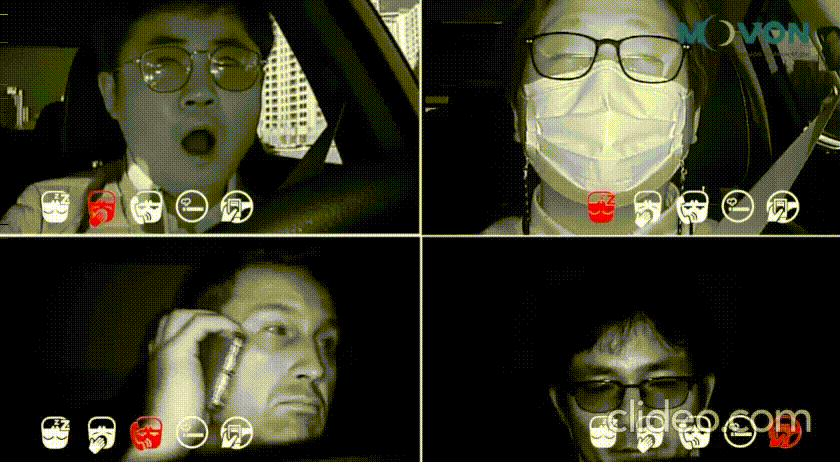

## DMS - Driver Safety Management Systems

---

### Gathered points -

1. Masstrans - https://www.masstrans.in/
2. Driver Awareness - https://github.com/Tauvic/DriverAwareness
3. Movon - MDSM-7 
4. Long duration fatigue warning - E.g. 2 hours on the dashboard.
5. Eye closed / sleep warning.
6. Yawn warning.
7. Phone usage warning.
8. Smoking warning.

---

### Contacts -

* quality@masstrans.in (Sachin Shembalay)
* arun.kumar@masstrans.in (Arun Kumar)
* sandeep.jadhav@masstrans.in (Sandeep Jadhav)
* amarnatha.c@masstrans.in (Amarnatha)