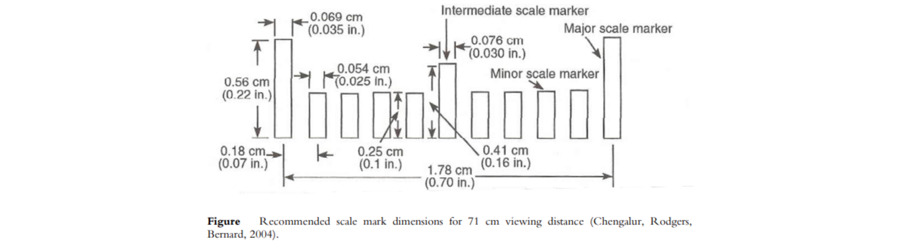

<!-- Author: Md. Aanis Noor -->
<!-- Organisation: Triton Electric Vehicles LLC, Kheda, Gujarat -->
<!-- Temp reference list: -->
<!-- https://www.diva-portal.org/smash/get/diva2:1016047/FULLTEXT01.pdf -->
<!-- http://www.librow.com/solutions/digital-instrument-cluster/design -->
#  Intrumentation Cluster

---

## Introduction
This is a documentation invloving study on good practices for creating a vehicle's digital instrumetation cluster. The following research content was gathered from various resources to build up an instrumetation cluster for Triton Electric Vehicles.

Digital instrument clusters are virtual ones. Now metal and plastic replaced with dynamic image.

##### [ Several features are ]

* Skinnable, configurable dashboard 
  - the cluster can have several designs: day and night, comfort and sport
* Interactivity
  - adding touch-screen or joystick opens access to car settings like trip counter, clocks, set of displayed parameters
* Virtuality
  - indicators and meters can behave the way impossible for real-metal boards

##### [ Graphical design falls into three important parts ] -

* **_Infographics_** — automotive dashboard is all about graphical representation of the car state information. Whatever the representation could be in any case it should be crystal clear and definitive. It should be easy to interpret the cluster at just a glance, with minimum efforts.

* **_Usability_** — it should be comfortable to use dashboard, which leads to idea of parameters priority, proper indicator placing, sizing and color coding.

* **_Interface_** — obviously the dashboard is interface, which speaks to the driver, and this point gets more important in the case the cluster is interactive. The language of interface should be clear and should help to find the shortest way to the goal, like setting the clocks or resetting the trip counter.

---

### [ Analysis of the shape ]
- Lines and surfaces create more or less dynamic shapes
- Sharp shapes indicate tensions
- Streamlined shapes and diagonals convey the impression of movement
  - An increase conveys a systematic and rhythmic organization of the parts

---

### [ Analysis of the color ]
- Humans have the ability to tell the difference between millions of colors
  - But yet colors should be used with caution
- Too many colors may distract and confuse the user of a
system
  - Colors also have different meaning and gives different associations to different people

_**(According to Kroemer, Kroemer and Kroemer, in Ergonomics _How to design for ease and efficiency_) -**_
#### _A few color combinations that could be used_

1. green, yellow, orange, red, and white;
2. blue, cyan, green, yellow, and white; 
3. cyan, green, yellow, orange, and white. 

#### _A few color combinations that should be avoided_
1. reds with blue;
2. reds with cyan; and
3. magentas with blues. 

---

### [ Scale ]
- Simple, uncluttered, and easy to read correctly and quick
-  The major marks on the scale should be numbered
   -  Designed to prevent the user from having to “guess” the value between
numbers
   - The maximum of minor markings between two major marks are nine, where
only the middle one has pronounced graduation.
   - More suitable is to use progressions in units of one, two, five, or ten.
 - Numerical values should be placed upright and outside the
dial to avoid them being overlapped by the pointer
- On a **circular dial**, the zero should be placed at nine o’clock or twelve o’clock, but if the scale does not go all around place the zero at six or twelve o’clock

---

### [ Pointer ]
* The pointer itself should not overlap the smaller markers and make them difficult to detect
* But it should reach the major scale marker with its tip so there are no differed opinions in where the pointer is pointing.
* To avoid misinterpretation when reading the dial from the side, the pointer should lay as close to the surface of the dial as possible.

---

## [ Labels and Warnings ]
Three factors in message design for labels and signs that enhance
communication:
1. Comprehensibility,
   * Measure of how reliably the receiver interprets a message.
   * Use simple language.
2. Legibility,
   * Label should be easy to interpret.
   * Consider - 
     * reading distance,
     * illumination level,
     * vibration,
     * motion in the environment
3. Readability
   * Concerns the ease of reading words and numbers, assuming that the individual characters are legible.

---

#### Good legibility practices under normal lighting conditions (read carefully):

* **_Stroke width_** – Between 1/8 and 1/6 of the height of
black letters on a white background, see Figure 12 for
definition of font characteristics. In darkrooms or
other reduced-light locations, white letters on a black
background tend to be more visible. In this case, the
stroke width should be between 1/10 and 1/8 of the
height.
* **_Character width_** - 3/5 of the character height, except
for I; one stroke width, M and W; 4/5 of the height.
In darkrooms or other reduced-light locations, the characters should be about 50%
larger.
* **_Number width_** - 3/5 of the number height, except for 1; one stroke width
* **_Letter and number height_** - depend on viewing distances and the criticalness of the
information;
For a viewing distance of 35 cm, the suggested height is 22 mm.
 For a viewing distance of 70 cm, the suggested height is 50 mm.
 For a viewing distance of 1 m, the suggested height is 70 mm.
 For a viewing distance of 1.5 m, the suggested height is 1 cm.
* **_Space between letters_** – at least on stroke width
* **_Space between words_** – at least one character width
* **_Characteristic openings/breaks in a letter/number_** - readily apparent
* Avoid the use of colored print. However, if colored letters or numbers must be used in
order to take advantage of color coding, note that legibility may be reduced. Figure illustrates different combinations of colors and their legibility in normal lighting
conditions. Use of color in reduced-light areas is less satisfactory. If colored light is
used, color combinations should be tested in that condition to assess their legibility
* Adapt materials and methods used for constructing labels and signs to the
environmental conditions. For instance, engraved labels should not be used in an
area where dirt is likely to fill in the indentations.
* Place labels and signs on the equipment in the workplace so that glare, reflections,
and shading do not make them difficult to read. If a sign or a label is placed
outdoors, pay attention to the changing direction of the sun when locating it in
order to improve its visibility. Matte surface paints may also be used to prevent unwanted reflections.

#### Good readablity practices under normal lighting conditions (read carefully):

* **_Orientation_** – The label/message should be oriented horizontally so it can be easily
and quickly read
* **_Location_** – Place labels/messages consistently throughout the system/equipment and
on or close to the item it signifies.
* Begin with a distinct heading or an illustration
* **_Typography_** - Take into account when selecting font: readability, purpose of the
product and nature of the company profile
* **_Letters_** – For headings or messages of a few words use only capitals. For longer
messages mix upper- and lowercases. Use italics only for emphasizing specific
words or short phrases or use underlining
* **_Abbreviations_** – Avoid abbreviations as far as possible because the make reading
more difficult and might leave the user in doubt about their meaning. If an
abbreviation is needed, use standard ones. If a new one is necessary, its meaning should be self-evident to the reader and it should be tested on inexperienced
subjects before use. The abbreviation should be used consequently and for the
singular and plural forms a word. Use capital letters and periods are normally
omitted.
* **_Brevity_** – The message should be as concise as possible without out leaving the user
in doubt, unambiguous and redundancy should be minimized.
* Avoid unnecessary difficult words and if possible use words of familiarity to the user.
* Divide and number the phases after the order they should be accomplished.
* Avoid negations; they make the word order ought to follow order of
actions. (Enter and close the door and not close the door after entering).
* **_Borders_** - Use borders between single
blocks of numbers or letters, see Figure Put distinctive borders around
critical labels or messages if several are
clustered in the same area. Keep the
embellishments to a minimum, because each one reduces the effectiveness of
display of the others.
* **_Figures_** - Representative figures (icons), abstract symbols and diagrams, frames, and
connecting lines should only be used when the layout, text content, and
typography do not achieve clear identification.
* **_Colors and patterns_** – In cases where the readability the aesthetic harmony and balance cannot be combined, the readability is more important. But an optimal synthesis should always be strived for in the design.

---
### [ Basic Information Units ]

* **_Speedometer_** – An instrument that presents information about the velocity of the vehicle in kilometres per hour or miles per hour.
  
* **_Tachometer_** – An instrument that presents information about the velocity of the engine in revolutions per minute (RPM).
  
* **_Battery level information_** – An instrument that presents information concerning the amount of fuel available.
  
* **_Motor temperature information_** – An instrument that presents information of the temperature of the engine.
  
* **_Tyre pressure information_** – An instrument that presents information of the oil pressure level.
  
* **_Clock_** – An instrument that presents the time of day.
  
* **_Outside temperature indicator_** – An instrument that presents the temperature, outside of the vehicle.
  
* **_Seatbelt reminder_** – An indicator which is to remind the driver to fasten their seatbelt.
  
* **_Which door is ajar_** – An indicator that provides the driver with information of which door/hatch is ajar.
  
* **_Which light is malfunctioning_** – An indicator that provides the driver with
information of which light bulb is malfunctioning.

* **_Cruise control indicator_** - An indicator that presents information concerning cruise control status.
  
* **_Climate control information_** – Information concerning temperature controls, climate control functions and temperature controls for the interior climate. 

* **_Entertainment information_** – Information about the vehicle entertainment system function and status.

* **_Mobile telephone information_** –Information from the mobile telephone connected to the vehicle.

* **_Trip computer_** – An onboard computer that provides the driver with information about average speed, average economy, fuel consumption, instant economy, miles remaining before empty, etc. Information that may be important to know on a longer trip.

* **_Scrollable menu of options_** – An menu that provides the driver with information about the status of the vehicle, such as service interval, mileage, temperature, vehicle malfunctions, fluid levels, etc. 
---

### [ Warning Symbols ]

* Warning symbol for low window washer fluid
  * Warning symbol that alerts the driver when the window washer fluid is low.

* Warning symbol for low tire pressure
  * Warning symbol that alerts the driver when the air pressure in the tires are low.

* Warning symbol for parking brake engaged 
  * Warning symbol that alerts the driver when the parking brake is engaged.

* Warning symbol for improper engine temperature 
  * Warning symbol that alerts the driver when the engine temperature is too high. High engine temperature may cause damage to the engine.

* Warning symbol for electrical charging system failure 
  * Warning symbol that alerts the driver when the battery is not being correctly charged.

* Warning symbol for airbag not in function 
  * Warning symbol that alerts the driver when something is wrong in the airbag system.

* Warning symbol for Anti-lock braking system (ABS) 
  * Warning symbol that alerts the driver when there is something wrong with the ABS brake system.

* Warning symbol for poor road conditions 
  * Warning symbol that alerts the driver when poor road conditions like slippery road, icy, rainy, poor visibility, etc occur.

* Warning symbol for malfunctioning light bulb 
  * Warning symbol that alerts the driver of a malfunctioning light bulb.

* Warning symbol for door is ajar 
  * Warning symbol that alerts the driver when a door is ajar.
  * (Left Front /Right Front /Left Back /Right Back /Trunk Open - **_Change accordingly for truck_**)

* Warning symbol for electrical malfunction 
  * Warning symbol that alerts the driver when there is a malfunction in the electrical system.

* REPLACE FOR ELECTRIC MOTOR
* Warning symbol for engine in need of service 
  * Warning symbol that alerts the driver when the automobile is in need of service.

---

### Instrument cluster API endpoints
